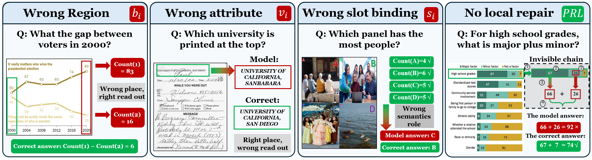
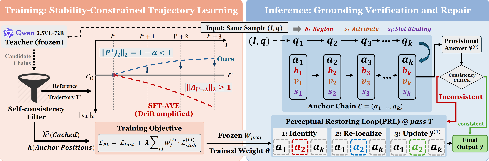
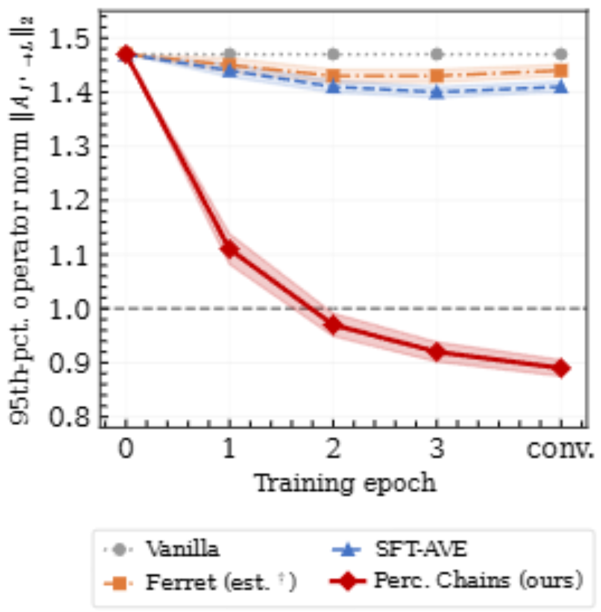
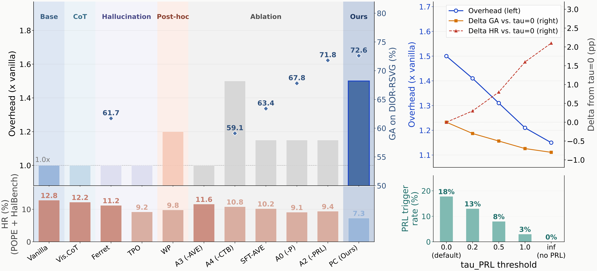

# Perception Chains: Stabilizing Multimodal Reasoning with Explicit Visual Intermediates


## Abstract

Multimodal chain-of-thought methods produce textual reasoning steps, but the visual grounding underlying each step is never made explicit. When a model attends to the wrong region, nothing in the chain records this: the error is unverifiable during inference, unlocalizable after the fact, and uncorrectable without regenerating the entire chain. We propose **Perception Chains**, which treats each reasoning step as a grounding commitment: before drawing any conclusion, the model must name a region, extract an attribute from that region, and assign it to a reasoning slot. With this structure in place, every grounding decision is independently checkable and a wrong answer is traceable to the step where the binding failed.

Correct output format, however, is not sufficient. A model satisfying the format can still leave its hidden states at anchor positions in a non-attenuating drift regime; standard fine-tuning has no mechanism to prevent this, as task-loss gradients are structurally decoupled from hidden-state geometry at intermediate anchor positions. A stability loss directly constrains this geometry, enforcing a transversal contraction property that task-loss gradients cannot induce regardless of training duration. High-quality reference trajectories are constructed without human annotation by retaining only chains where independent samples from a frozen 72B VLM converge, filtering at the anchor level rather than by answer correctness alone. At inference time, a consistency check identifies anchors whose evidence conflicts with the provisional answer; only those anchors are re-localized before the final answer is committed.

On eight benchmarks against six baselines, Perception Chains achieves the highest average accuracy, with the largest gains on tasks requiring precise region-attribute binding. On DIOR-RSVG, grounding accuracy rises from 61.7% to 72.6% over the strongest spatial baseline. The stability loss, not the anchor format, is the transferable component: gains carry to seven held-out benchmarks unseen during training.

**Keywords:** multimodal reasoning, visual grounding, chain-of-thought, representation stability, knowledge distillation

---

## 1 Introduction

Multimodal large language models have made rapid progress on visual question answering by coupling language reasoning with visual perception. A prominent line of work improves multi-step accuracy by having the model produce a chain of reasoning steps before committing to a final answer. Structuring the reasoning process in this way reduces answer hallucination, but it leaves a fundamental problem untouched: every intermediate step makes a claim about the image without naming any spatial region. When a model attends to the wrong part of the image, nothing in the chain records this. The claim is accepted, propagated, and only revealed as wrong by the final answer. Grounding errors are unverifiable during inference, unlocalizable after the fact, and uncorrectable without regenerating the entire chain from scratch.

Perception Chains treats grounding as a two-level problem:

- **At the output level**, Anchored Visual Evidence (AVE) requires each reasoning step to name a region, extract an attribute from that region, and assign that attribute to a reasoning slot before drawing any conclusion.
- **At the representation level**, satisfying AVE at the output does not mean the model's internal states are well-grounded. The Stability Loss addresses this directly by constraining how far the model's hidden state at each anchor position can deviate from the teacher's grounding direction — a property that task-loss gradients cannot enforce by construction (Theorem 1).



**Figure 1:** Four failure modes in current MLLMs (upper rows) and their anchor-level decomposition (lower rows). Columns 1–3 show structurally independent error types: wrong region (b_i), wrong attribute (v_i), wrong slot binding (s_i). Column 4 shows a consistent-but-wrong chain that lies outside the reach of local repair.

### Contributions

- We show that over 99% of calibration inputs remain in a non-attenuating drift regime after format-only fine-tuning, establishing that output-level grounding compliance and representational grounding quality are structurally decoupled.
- We propose AVE, which makes every grounding decision in a reasoning chain independently checkable and localizable.
- We propose a stability loss that constrains hidden-state geometry at anchor positions, enforcing a property that task-loss gradients cannot induce.
- We construct high-quality teacher trajectories without human annotation by filtering at the intermediate anchor level via self-consistency over a frozen 72B VLM.
- We propose the Perceptual Restoring Loop (PRL), which treats evidence-answer inconsistency as an inference-time-correctable failure mode dissociable from localization accuracy, and corrects it without retraining.

---

## 2 Problem Formulation

**Three failure modes and one boundary.** Errors in region selection, attribute extraction, and slot assignment are structurally independent: each is a distinct failure at a different component of the grounding step, and each is opaque under text-only intermediate representations. A chain whose every step is internally consistent can still produce a wrong answer — a case that no per-step check can detect.

**Definition (Visual Anchor Node).** A visual anchor node is a triple a_i = (b_i, v_i, s_i), where b_i ∈ B is a spatial region in I (an axis-aligned bounding box or soft attention mask), v_i ∈ V is a structured tuple of visual attributes extracted from the sub-image delimited by b_i, and s_i ∈ S is a reasoning slot in the template obtained by decomposing question q into K sub-questions.

An anchor chain C = (a_1, …, a_K) is an ordered sequence of anchor nodes produced before ŷ. Each node is independently checkable.

---

## 3 The Perception Chains Framework



**Figure 2:** Perception Chains overview. **Left (Training):** A frozen 72B teacher's self-consistent trajectories are cached offline. The stability loss drives ‖P⊥J_l‖₂ < 1 at each active anchor layer (blue); SFT-AVE leaves ‖A_{l*→L}‖₂ ≥ 1 throughout training (red, drift amplified). **Right (Inference):** AVE assembles anchor chain C = (a₁, …, a_K); PRL flags inconsistent anchors I and re-localizes before committing the final answer.

### 3.1 Anchored Visual Evidence (AVE)

- **Question decomposition and slot template.** A fixed instruction prefix prompts the model to decompose question q into K sub-questions q_1, …, q_K, each assigned one reasoning slot s_i ∈ S. The number of slots is fixed at K = 4.
- **Region localisation (b_i).** For sub-question q_i, the model produces a bounding box b_i = [x₁, y₁, x₂, y₂] as four normalised coordinates in [0, 1000], following the Qwen2.5-VL format. The box token appears immediately after the slot label and before the attribute value token.
- **Attribute extraction (v_i).** The model extracts a structured attribute tuple v_i ∈ V from within region b_i; the schema is slot-specific and enforced via constrained decoding.
- **Chain assembly.** The chain C = (a₁, …, a_K) is assembled in order; the final answer ŷ is generated from C and the full image.

### 3.2 Stability Loss

Even when the model produces a correctly structured C, the hidden states at anchor positions can drift away from the teacher's trajectory across layers. Standard SFT minimises L_task at the final answer token; its gradient carries no constraint on hidden-state geometry at intermediate anchor positions.

**Transversal subspace and composite operator.** The grounding-relevant transversal subspace at layer l, anchor i is the orthogonal complement of the teacher's reasoning direction u\*. The composite transported transversal operator:

```
A_{l*→L} ≜ P⊥^(L) J_{L-1} P⊥^(L-1) ⋯ J_{l*} P⊥^(l*)
```

tracks how a transversal perturbation at the first active anchor layer l\* propagates through all subsequent layers. When ‖A_{l\*→L}‖₂ ≥ 1, a direction exists that no subsequent layer attenuates.

**Loss definition.** Let ĥ^(i)_l ∈ ℝ^{d_s} denote the student's post-LayerNorm hidden state at the first region-coordinate token of anchor a\*_i (d_s = 3584 for Qwen2.5-VL-7B). Let h̃\*^(i)_l = W_proj h\*^(i)_l ∈ ℝ^{d_s} be the teacher's projected state, where W_proj ∈ ℝ^{d_s × d_t} (d_t = 7168, Qwen2.5-VL-72B) is fitted by PCA on 1,000 samples and frozen throughout. For perturbation δ ~ N(0, σ²I), σ = 0.01:

```
L_stab^(l,i) = E_δ[ ‖ P⊥^(l,i) (Δ̃^(i,δ)_l − Δ̃*^(i)_l) + α P⊥^(l,i) δ ‖² ]
```

**Theorem 1 (Strict Transversal Contraction).** Under the single-token independence assumption (β ≜ ‖J_off‖_F / ‖J_diag‖_F ≪ 1; measured 0.083 ± 0.029), if L_stab = 0 with σ > 0 and α ∈ (0,1), then ‖P⊥ J_l‖₂ = 1 − α < 1.

**Overall training objective:**

```
L_PC = L_task + λ Σ_{i=1}^{K} Σ_{l ∈ L_active^(i)} w_l^(i) · L_stab^(l,i)
```

where λ = 1.0. Layer l is active for anchor i if the teacher update magnitude exceeds the 5th percentile; α = 0.10.

### 3.3 Confidence-Weighted Trajectory Bootstrapping (CTB)

**Phase 1: Cold start.** A frozen Qwen2.5-VL-72B teacher generates k = 8 anchor chain candidates per sample for seed set D_cold (|D_cold| = 5×10³, τ_samp = 0.7, top-p = 0.9). A chain is retained only if all k samples agree on the final answer via exact match. Hidden states are cached (≈110 GB, float16).

**Phase 2: Self-bootstrap.** Starting from the Phase 1 checkpoint, the 7B student generates k = 8 chains per sample and scores each by:

```
conf(C_j) = ā(C_j) · crr(C_j) · tsc(C_j)
```

where ā is normalised slot-level anchor agreement, crr is ground-truth match, and tsc is 72B verifier's binary judgment. Chains with conf < τ_conf = 0.5 are excluded. Phase 2 runs for two rounds, incorporating ≈3×10⁴ additional trajectories.

### 3.4 Perceptual Restoring Loop (PRL)

1. **Vote.** Sample N_vote = 4 chains at τ_samp = 0.7; take the majority-vote answer as ŷ⁽⁰⁾.
2. **Select.** Choose the chain with the highest ā(C) consistent with ŷ⁽⁰⁾.
3. **Identify.** Check chain consistency with ŷ⁽⁰⁾. If inconsistent, identify I ⊆ {1,…,K} — slots where v_i contradicts ŷ⁽⁰⁾.
4. **Repair.** Re-localise only anchors in I, using ŷ⁽⁰⁾ as prior, to produce ŷ⁽¹⁾.

Steps 3–4 repeat for at most T_max = 2 iterations. Consistency criterion: exact string match for closed-ended tasks; NLI entailment (DeBERTa-v3-large, contradiction threshold 0.5) for open-ended tasks.

---

## 4 Experiments

The experiments address four questions: whether explicit grounding commitments are **necessary** (Stage 1); whether anchor-format supervision alone is **sufficient** to suppress hidden-state drift (Stage 2); whether CTB and PRL contribute **independently** (Stage 3); and whether gains **generalize** across architectures and unseen task families (Stage 4).

### 4.1 Setup

**Backbone and training data.** All methods are fine-tuned from the same **Qwen2.5-VL-7B** checkpoint. Balanced mixture of 1.25×10⁴ instances per benchmark, yielding 10⁵ training examples. Seven extended benchmarks are never seen during training.

**Baselines.** All training-time baselines ported to Qwen2.5-VL-7B under the same data mixture and schedule.

**Implementation.** AdamW (lr 2×10⁻⁵, cosine decay, effective batch 256, 8×A100) for three epochs. λ = 1.0, σ = 0.01, α = 0.10; W_proj frozen after PCA on 1,000 held-out samples. Results are the mean over seeds {42, 0, 2}.

### 4.2 In-Distribution Results (8 Seen Benchmarks)

| ID | Category | Method | ChartQA↑ | DocVQA↑ | RSVQA↑ | DIOR-RSVG↑ | MuMuQA↑ | MMIU↑ | POPE HR↓ | HalBench HR↓ |
|----|----------|--------|----------|---------|--------|------------|---------|-------|----------|-------------|
| | Base | Vanilla Qwen2.5-VL-7B | 88.6 | 95.9 | 87.4 | N/A | 66.8 | 57.9 | 12.8 | 47.1 |
| | CoT | Visual CoT | 88.8 | 95.6 | 87.6 | N/A | 67.2 | 58.1 | 12.2 | 45.8 |
| | Grounding | Ferret | 88.7 | 95.5 | 88.7 | 61.7 | 68.8 | 59.6 | 11.2 | 44.8 |
| | Hallucination | TPO | 88.4 | 95.7 | 87.3 | N/A | 66.7 | 57.8 | 9.2 | 33.2 |
| | Post-hoc | Woodpecker | 88.6 | 95.9 | 87.4 | N/A | 66.8 | 57.9 | 9.8 | 45.8 |
| A1 | Ablation | SFT-AVE | 89.8±0.4 | 96.2±0.3 | 89.5±0.6 | 63.4±0.9 | 71.2±0.6 | 61.5±0.7 | 10.2±0.3 | 43.1±1.4 |
| A3 | Ablation | w/o AVE (text CoT only) | 88.1 | 95.4 | 87.2 | N/A | 66.3 | 57.6 | 11.6 | 46.2 |
| | **Ours** | **Perception Chains** | **91.4±0.3** | **96.8±0.2** | **92.6±0.5** | **72.6±0.7** | **74.3±0.5** | **64.8±0.6** | **7.3±0.2** | **31.8±1.2** |

### 4.3 Zero-Shot Results (7 Unseen Benchmarks)

| Category | Method | GQA↑ | TextVQA↑ | AI2D↑ | ObjHal F1↑ | Hallucinogen↑ | RefCOCO↑ | Flickr30k↑ |
|----------|--------|------|----------|-------|------------|---------------|----------|------------|
| Base | Vanilla Qwen2.5-VL-7B | 63.4 | 73.8 | 79.3 | 85.7 | 35 | N/A | N/A |
| CoT | Visual CoT | 63.8 | 74.1 | 79.6 | 87.1 | 34 | N/A | N/A |
| Grounding | Ferret | 63.1 | 73.5 | 79.1 | 87.5 | 36 | 63.0 | 67.0 |
| Halluc. | TPO | 64.0 | 74.1 | 79.6 | 91.2 | 43 | N/A | N/A |
| Post-hoc | Woodpecker | 63.5 | 73.9 | 79.3 | 89.2 | 36 | N/A | N/A |
| Ablation | SFT-AVE | 64.9 | 75.0 | 80.6 | 90.1 | 44 | 58.0 | 63.0 |
| **Ours** | **Perception Chains** | **66.1** | **76.9** | **82.1** | **92.3** | **51** | **66.0** | **70.0** |

Perception Chains exceeds Ferret on RefCOCO (66.0 vs. 63.0) and Flickr30k (70.0 vs. 67.0) **without any referring- or phrase-grounding training**.

### 4.4 Stage 2: Stability Loss Necessity

**Composite transversal operator norm ‖A_{l\*→L}‖₂:**

| Checkpoint | Mean | Median | 95th pct | Frac. > 1 |
|------------|------|--------|----------|-----------|
| Vanilla (pre-trained) | 1.32 | 1.31 | 1.47 | >99% |
| SFT-AVE (format, no stab. loss) | 1.26 | 1.25 | 1.41 | >99% |
| **Perception Chains** | **0.79** | **0.78** | **0.89** | **<1%** |



**Figure 3:** Training dynamics of the 95th-percentile composite transversal operator norm ‖A_{l\*→L}‖₂.

Format training alone barely moves the operator norm: over 99% of inputs still exhibit non-attenuating drift after SFT-AVE. The stability loss collapses this to under 1%.

**Gradient decoupling:** cosine similarity between ∇θL_task and ∇θL_stab at anchor positions is 0.031 ± 0.019 (p = 0.14, non-significant) vs. 0.183 ± 0.041 (p < 0.01) at the final answer token.

**Stage 2 ablation:**

| ID | Variant | ChartQA↑ | DocVQA↑ | RSVQA↑ | DIOR-RSVG↑ | MuMuQA↑ | MMIU↑ | POPE HR↓ | HalBench HR↓ |
|----|---------|----------|---------|--------|------------|---------|-------|----------|-------------|
| | Perception Chains | 91.4 | 96.8 | 92.6 | 72.6±0.7 | 74.3 | 64.8 | 7.3±0.2 | 31.8 |
| A1 | w/o stability loss (SFT-AVE) | 89.8 | 96.2 | 89.5 | 63.4±0.9 | 71.2 | 61.5 | 10.2±0.3 | 43.1 |
| A0 | Full-HS distill (no P⊥) | 90.4 | 96.5 | 90.8 | 67.8 | 72.4 | 62.8 | 9.1 | 38.2 |

A0: replacing P⊥ with full hidden-state L2 distillation recovers 4.4 of the 9.2-point gap, but the remaining 4.8 points show that constraining irrelevant directions imposes a cost that geometric specificity avoids.

### 4.5 Stage 3: CTB and PRL Independence

**CTB trajectory quality** (stability loss and format unchanged):

| ID | Variant | DIOR-RSVG↑ | POPE HR↓ |
|----|---------|------------|----------|
| | Perception Chains (full) | **72.6±0.7** | **7.3±0.2** |
| A4c | 72B unfiltered (no quality filter) | 71.1 | 7.9 |
| A4b | STaR (answer-filtered; no anchor agreement) | 68.7 | 8.5 |
| A4 | Random trajectories | 59.1 | 10.8 |

**PRL inference-time mechanism** (training unchanged):

| ID | Variant | DIOR-RSVG↑ | POPE HR↓ |
|----|---------|------------|----------|
| A2c | PRL-all (re-localize all K anchors) | 72.7 | 7.0 |
| A2b | PRL-random (same |I|, random selection) | 72.2 | 8.4 |
| A2 | w/o PRL | 71.8 | 9.4 |

Removing PRL raises hallucination rate while leaving grounding accuracy nearly unchanged — PRL corrects output-level inconsistency, not localization quality.

### 4.6 Stage 4: Generalization

**Cross-architecture results:**

| Architecture | Pre-norm† | β | ΔCQA↑ | ΔHR↓ | ΔGA↑ | CF |
|-------------|-----------|-------|-------|------|------|-----|
| Qwen2.5-VL-7B | 1.47 | 0.083 | +2.8 | −5.5 | +9.2 | 0.903±0.041 |
| InternVL2-8B | 1.44 | 0.079 | +2.6 | −4.8 | +8.4 | 0.908±0.038 |
| LLaVA-NeXT-8B | 1.52 | 0.091 | +3.1 | −5.9 | +8.6 | 0.897±0.044 |
| Idefics3-8B | 1.58 | 0.097 | +3.4 | −6.2 | +9.4 | 0.891±0.048 |

† 95th-percentile ‖A_{l\*→L}‖₂ on 1,000 calibration inputs.

**Out-of-distribution transfer:**

| Method | In-dist | Set A (near) | Set B (medium) | Set C (far) |
|--------|---------|-------------|----------------|-------------|
| Visual CoT | +0.1 | −0.1 | −0.2 | +0.1 |
| Woodpecker | −0.2 | −0.3 | −0.4 | −0.1 |
| Ferret | +0.8 | +0.6 | +0.4 | +0.3 |
| SFT-AVE | +1.5 | +0.9 | +0.7 | +0.6 |
| SFT-AVE + PRL | +1.7 | +1.0 | +0.8 | +0.7 |
| **Perception Chains** | **+3.4** | **+2.2** | **+1.7** | **+1.4** |

The anchor format alone does not generalize; the representation change induced by the stability loss does.

---

## 5 Analysis

### 5.1 Why Spatial Tasks Benefit Most

**Pre-training operator norm by task family:**

| Task family | Pre-norm (mean ± std) | 95th pct |
|-------------|----------------------|----------|
| Remote Sensing | 1.41±0.09 | 1.56 |
| Multi-Image | 1.34±0.08 | 1.47 |
| Chart QA | 1.31±0.07 | 1.43 |
| Hallucination | 1.28±0.07 | 1.40 |
| Document | 1.24±0.06 | 1.34 |

The pre-norm ordering matches the accuracy-gain ordering exactly. Tasks where text-based pre-training provides little signal accumulate more drift, leaving more for the stability loss to correct. Pre-norm is measurable before fine-tuning begins and serves as a predictor of per-family gain.

### 5.2 Inference Cost and Deployment Flexibility



**Figure 4:** Inference overhead and accuracy across all methods and ablations (left), and the accuracy–overhead trade-off as τ_PRL varies (right).

Training adds 1.44× the compute of vanilla fine-tuning (69 vs. 48 GPU-hours). Average inference overhead is 1.50×.

**Accuracy–overhead trade-off as τ_PRL is varied:**

| τ_PRL | Trigger rate | Overhead | GA↑ | HR↓ |
|-------|-------------|----------|-----|-----|
| 0.0 (default) | 17.8% | 1.50× | **72.6** | **7.3** |
| 0.2 | 13% | 1.41× | 72.3 | 7.6 |
| 0.5 | 8% | 1.31× | 72.1 | 8.1 |
| 1.0 | 3% | 1.21× | 71.9 | 8.9 |
| ∞ (no PRL) | 0% | 1.15× | 71.8 | 9.4 |

**PRL trigger rate by task family:**

| Task family | PRL rate | AVE only | Total |
|-------------|----------|----------|-------|
| Remote Sensing | 24% | 1.15× | 1.62× |
| Multi-Image | 20% | 1.15× | 1.55× |
| Hallucination | 16% | 1.15× | 1.49× |
| Chart QA | 15% | 1.15× | 1.48× |
| Document | 13% | 1.15× | 1.44× |
| Average (all) | 17.8% | 1.15× | 1.50× |

82.2% of samples incur zero PRL overhead at the default threshold.

### 5.3 Failure Mode Analysis

At τ = ∞ (no PRL), grounding accuracy is 71.8% and hallucination rate is 9.4%, confirming that the stability loss alone drives the representational gains. The blind spot differs by task:

- **Remote Sensing:** mostly region-proposal failures after PRL triggers (24%); re-localizations sometimes still fail, exposing a ceiling imposed by the region-proposal mechanism.
- **Chart QA:** wrong numerical reads from the right region, which produce no inconsistency (15% trigger rate); the extracted attribute is internally plausible so PRL has no signal.
- **Document:** slot-assignment errors — region and attribute both correct, but bound to the wrong slot — maximally internally consistent (13% trigger rate, +0.9 gain).

---

## 6 Limitations and Future Work

Three classes of errors cannot be reached, each for a distinct structural reason. For Remote Sensing, PRL triggers at the highest rate (24%) but a portion of re-localizations still fail to find the correct region after triggering, exposing a ceiling imposed by the region-proposal mechanism rather than the consistency check itself. For Chart QA, the model localizes the correct region but extracts the wrong numerical value; because the extracted attribute is internally plausible, no evidence-answer inconsistency arises. For Document understanding, slot-assignment errors are internally consistent by construction — region correct, attribute correct, but bound to the wrong slot — which directly accounts for the lowest trigger rate (13%) and smallest gain (+0.9) of any task family.

---

## Installation

```bash
pip install -r requirements.txt
```

## Pipeline

```bash
# Step 1: Fit W_proj (PCA projection, frozen)
python scripts/fit_wproj.py --teacher_model Qwen/Qwen2.5-VL-72B-Instruct \
    --student_model Qwen/Qwen2.5-VL-7B-Instruct --num_calibration 1000 --output_path data/wproj.pt

# Step 2: CTB Phase 1 — Cache teacher trajectories
python scripts/run_ctb_phase1.py --teacher_model Qwen/Qwen2.5-VL-72B-Instruct \
    --output_dir data/ctb_cache --num_samples 5000 --k 8

# Step 3: Train
torchrun --nproc_per_node=8 scripts/train.py --config configs/perception_chains.yaml

# Step 4: CTB Phase 2 — Self-bootstrap
python scripts/run_ctb_phase2.py --student_ckpt outputs/checkpoint-final --rounds 2

# Step 5: Evaluate
python scripts/evaluate.py --model_path outputs/final --benchmarks seen --use_prl
```

## Repository Structure

```
perception_chains/
├── assets/                  # Place figures here (see below)
├── configs/
│   └── perception_chains.yaml
├── data/
│   └── dataset.py
├── models/
│   ├── ave.py               # §3.1 Anchored Visual Evidence
│   └── model.py             # Qwen2.5-VL wrapper + teacher
├── training/
│   ├── stability_loss.py    # §3.2 Stability Loss + W_proj
│   ├── ctb.py               # §3.3 CTB
│   └── trainer.py           # L_PC = L_task + λΣL_stab
├── inference/
│   └── prl.py               # §3.4 PRL
├── evaluation/
│   └── evaluator.py
└── scripts/
    ├── fit_wproj.py
    ├── run_ctb_phase1.py
    ├── train.py
    ├── run_ctb_phase2.py
    ├── evaluate.py
    └── measure_operator_norm.py
```

## Citation

```bibtex
@inproceedings{perceptionchains2026,
  title={Perception Chains: Stabilizing Multimodal Reasoning with Explicit Visual Intermediates},
  author={DongqiZuo}
  year={2026}
}
```
